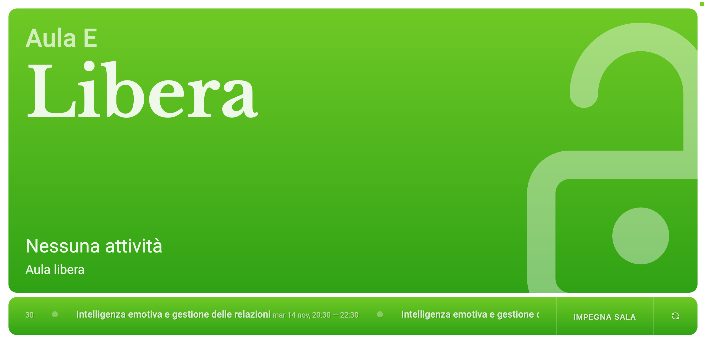
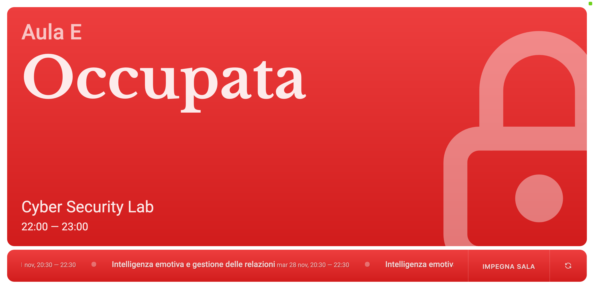
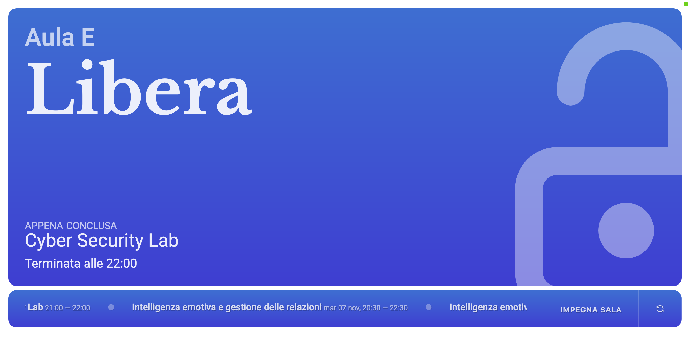
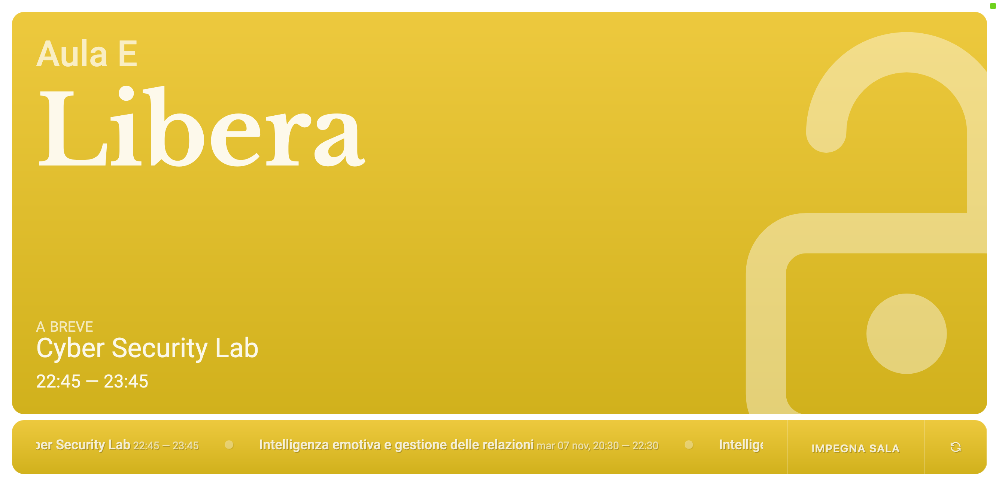

# Room Calendar Sign

This is a simple web application using Flask and Google Calendar APIs to display whether a room is available or not, preferably on a tablet mounted outside the room.

## Setup

### Google Calendar API

In order to use this application, you will need to create a Google Calendar API project and enable the Calendar API. You can do this by following the instructions [here](https://developers.google.com/calendar/quickstart/python).

Successful completion of the instructions will result in a `credentials.json` file being downloaded to your computer. This file will be used by the application to authenticate with the Google Calendar API.

The first time you attempt authentication, you will be prompted to authorize the application to access your Google Calendar. This will result in a `token.json` file being created in the same directory as `credentials.json`. This file will be used by the application to authenticate with the Google Calendar API from now on (it expires once every 2 hours, but the application will automatically refresh it without prompting authorisation again).

### Application

Place your `credentials.json` file in `src/calendar_sign` and run the application with

```sh
python -m calendar_sign
```

from the `src` directory. The `token.json` file will be created in the same directory as `credentials.json` once you have authorised the application to access your Google Calendar.

## Screenshots

<p align="center">
  
  
</p>
<p align="center">
  
  
</p>

- In <b style="color: green">green</b>: Available
- In <b style="color: red">red</b>: Unavailable
- In <b style="color: blue">blue</b>: An activity has recently ended
- In <b style="color: gold">yellow</b>: An activity is about to begin
